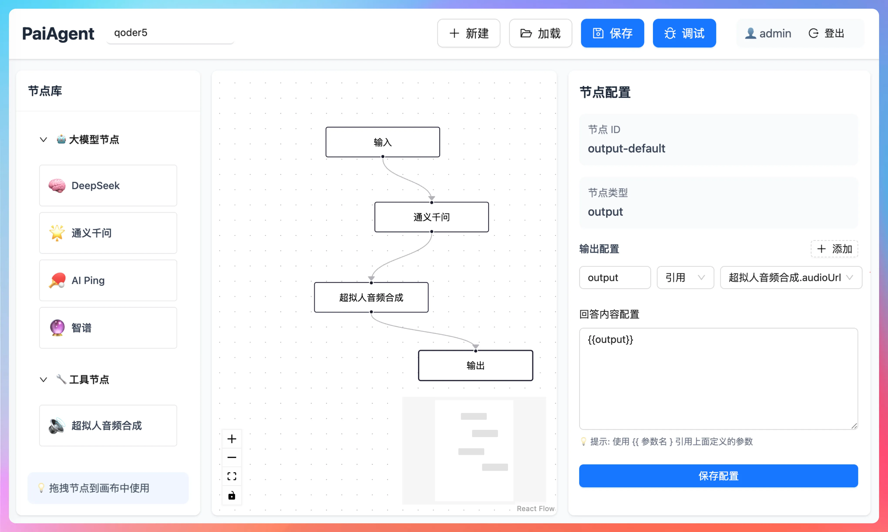
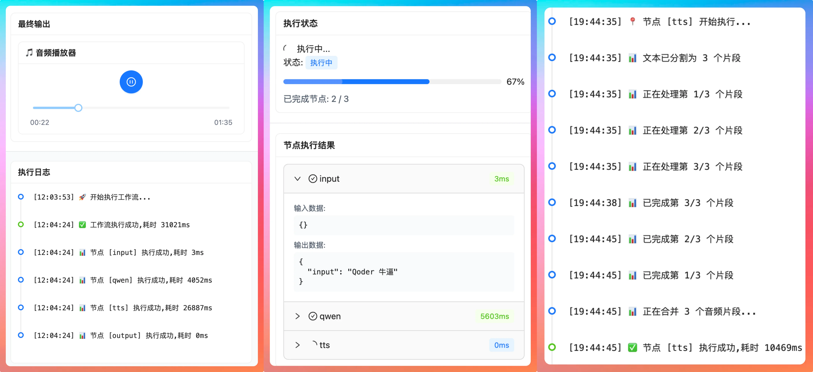

# PaiAgent Java AI Workflow

基于 Java 21、Spring Boot、ReactFlow 的 AI 工作流可视化编排平台。项目支持通过拖拽方式组合 `input -> llm -> tts -> output` 等节点，将大模型调用、语音合成、文件存储和执行调试封装成可复用的工作流能力。

本仓库基于 [itwanger/PaiAgent](https://github.com/itwanger/PaiAgent) 进行本地复现与二次增强，保留原项目的可视化工作流核心思路，并补充了用户体系、敏感配置加密、TTS + MinIO 完整链路、Docker Compose 部署等工程化能力。

## 项目定位

PaiAgent 可以理解为一个轻量版 Dify / Coze 类平台的 Java 实现：用户不直接写代码，而是在画布上拖拽节点，配置模型和参数，然后由后端工作流引擎按节点依赖关系执行。

典型链路：

```text
用户输入 -> LLM 节点生成文本 -> TTS 节点合成语音 -> MinIO 保存音频 -> 输出结果
```

适合用于：

- 大模型应用开发练习与面试展示
- Java 后端 AI Agent / Workflow 项目复现
- LLM、TTS、对象存储、SSE 调试的工程化整合
- 已支持 DAG / LangGraph 条件分支，后续可扩展 RAG、分类器、Agent 状态流等能力

## 核心功能

### 可视化工作流编辑

- 基于 ReactFlow 实现节点拖拽、连线、保存、加载和删除
- 支持输入节点、LLM 节点、TTS 节点、条件分支节点、输出节点
- 支持工作流保存到 MySQL，并在前端重新加载编辑
- 修复节点拖拽落点偏移和重复加载异常问题



### DAG 工作流引擎

- 后端基于 DAG 解析工作流节点和边
- 使用拓扑排序确定节点执行顺序
- 使用循环检测避免工作流死循环
- 节点输出会作为下游节点输入继续传递
- 条件节点支持根据 true / false 出口动态选择后续执行分支
- 执行结果会记录到数据库，方便回溯调试

### 条件分支节点

- 支持 if/else 类型的流程控制节点
- 支持引用上游节点输出或填写固定值作为判断左值
- 支持等于、不等于、包含、不包含、为空、大于、小于等常用判断条件
- 条件成立时执行 true 出口，条件不成立时执行 false 出口
- DAG 引擎会跳过未命中分支，LangGraph 引擎会通过 conditional edge 路由到命中分支

### LangGraph4j 状态图引擎

- 支持将可视化工作流转换为 LangGraph4j `StateGraph`
- 支持 `condition` 节点通过 conditional edge 执行 true / false 分支
- 支持循环边，适合表达“执行节点 -> 判断条件 -> 未满足则回到前置节点”的状态流
- 内置最大迭代次数保护，避免错误工作流导致无限循环

### LLM 多模型接入

- 支持 OpenAI 兼容格式的模型调用
- 已适配 Qwen、Zhipu、DeepSeek、OpenAI、AIPing 等供应商类型
- 支持全局 LLM 配置，工作流节点可以引用已有配置
- 普通用户只能读取脱敏后的模型配置，管理员可新增、修改、删除配置

### TTS + MinIO 音频节点

TTS 节点已经实现完整链路：

- 超过 600 字符的文本会按标点智能分段
- 每个文本分段独立调用 TTS API
- 下载多个音频片段并合并为单个 WAV 文件
- 上传合并后的音频到 MinIO
- 返回可直接访问的预签名音频 URL

### 实时执行调试

- 后端通过 SSE 推送执行事件
- 前端调试面板展示工作流开始、节点开始、节点成功、工作流完成等状态
- 支持查看每个节点输入、输出、耗时和最终结果



### 用户与权限

- 新增注册和登录接口
- 密码使用 BCrypt 加密存储
- JWT 负责访问令牌，Redis 存储 refresh token
- 支持 `ADMIN` / `USER` 两类角色
- 普通用户只能访问自己的工作流
- 管理员可管理全局 LLM 配置

### API Key 加密存储

- 数据库中的模型 API Key 使用 AES/GCM 加密保存
- 接口返回时按角色做脱敏或解密
- 工作流 JSON 中的节点级 `apiKey` 也会在保存时加密
- 项目启动时会自动迁移旧明文 API Key

### Docker Compose 一键部署

- 提供 MySQL、Redis、MinIO、后端、前端的一键编排
- 前端使用 Nginx 托管静态资源，并反向代理 `/api`
- 支持本机演示和局域网访问

## 技术栈

| 模块 | 技术 |
| --- | --- |
| 后端 | Java 21、Spring Boot 3.4.1、MyBatis-Plus、Spring Security Crypto |
| AI 调用 | Spring AI、OpenAI Compatible API、DashScope / Qwen、Zhipu GLM |
| 工作流 | 自研 DAG 引擎、LangGraph4j 状态图引擎 |
| 数据库 | MySQL |
| 缓存 | Redis |
| 文件存储 | MinIO |
| 前端 | React 18、TypeScript、Vite、ReactFlow、Ant Design、Zustand |
| 部署 | Docker Compose、Nginx |

## 系统架构

```text
Frontend
  React + ReactFlow + Ant Design
        |
        | REST / SSE
        v
Backend
  Spring Boot
  Auth / Workflow / LLM Config / Execution
        |
        | MyBatis-Plus
        v
MySQL

Backend -> Redis      : refresh token / runtime cache
Backend -> MinIO      : audio file storage
Backend -> LLM / TTS  : model provider API
```

## 工作流执行流程

```text
1. 前端在 ReactFlow 画布上编辑节点和边
2. 保存时将工作流 JSON 写入 MySQL
3. 执行时后端读取 workflow.flow_data
4. DAGParser 解析节点依赖并做拓扑排序
5. WorkflowEngine 按顺序调用对应 NodeExecutor
6. 每个节点输出写入上下文并传给下游节点
7. SSE 将执行事件实时推送到前端调试面板
8. 执行记录写入 execution_record
```

## 本地开发

### 环境要求

- JDK 21
- Maven 3.9+
- Node.js 20+
- MySQL 8+
- Redis
- MinIO

### 后端配置

复制环境变量模板：

```powershell
Copy-Item backend/.env.example backend/.env
```

按本地环境修改 `backend/.env`：

```text
MYSQL_HOST=localhost
MYSQL_PORT=3306
MYSQL_DATABASE=paiagent
MYSQL_USERNAME=root
MYSQL_PASSWORD=123456

REDIS_HOST=localhost
REDIS_PORT=6379
REDIS_PASSWORD=123456

MINIO_ENDPOINT=http://localhost:9000
MINIO_PUBLIC_URL=http://localhost:9000

JWT_SECRET=change_me_to_a_long_random_string
API_KEY_ENCRYPTION_SECRET=change_me_to_another_long_random_string
```

初始化数据库：

```powershell
mysql -u root -p paiagent < backend/src/main/resources/schema.sql
```

启动后端：

```powershell
cd backend
mvn spring-boot:run
```

Swagger 地址：

```text
http://localhost:8085/swagger-ui.html
```

### 前端配置

复制环境变量模板：

```powershell
Copy-Item frontend/.env.example frontend/.env.local
```

本地开发推荐：

```text
VITE_API_BASE_URL=/api
VITE_API_PROXY_TARGET=http://localhost:8085
```

启动前端：

```powershell
cd frontend
npm install
npm run dev
```

访问地址：

```text
http://localhost:5173
```

默认管理员：

```text
admin / admin123
```

## Docker Compose 部署

项目根目录提供 `docker-compose.yml`，可一键启动完整演示环境。

```powershell
docker compose up -d --build
```

访问地址：

```text
前端：http://localhost:5173
后端 Swagger：http://localhost:8085/swagger-ui.html
MinIO Console：http://localhost:9001
```

如果需要局域网访问，修改根目录 `.env`：

```text
MINIO_PUBLIC_URL=http://你的局域网IP:9000
```

其他电脑访问：

```text
http://你的局域网IP:5173
```

更多说明见 [Docker Compose 部署文档](docs/deploy-compose.md)。

## 已完成的增强

- 完成本地后端、前端、MySQL、Redis、MinIO 联调
- 完成 Qwen / Zhipu LLM 节点调用验证
- 完成 `input -> llm -> tts -> output` 工作流链路
- 修复 MinIO 预签名 URL 在浏览器侧不可访问的问题
- 增加工作流删除、二次确认和列表刷新
- 增加注册、登录、角色权限和用户工作流隔离
- 增加 BCrypt 密码加密
- 增加 API Key AES/GCM 加密存储和启动迁移
- 增加执行可靠性基础版：运行中状态记录、节点超时、失败重试、错误日志、重试事件推送
- 增加 DAG if/else 条件分支节点：支持 true / false 出口、上游参数引用和动态分支执行
- 跑通 LangGraph4j conditional edge 条件分支和基础循环执行，并补充自动化测试
- 增加 Docker Compose、Dockerfile、Nginx 配置和部署文档

## 当前边界

- DAG 引擎是当前主要稳定路径，适合常规工作流执行
- LangGraph4j 已支持条件分支和基础循环，但复杂 Agent 状态流、人工中断、检查点恢复仍属于后续增强方向
- RAG 知识库节点暂未实现
- 执行中断、工作流发布版本、执行快照等高级可靠性能力仍可继续扩展

## 简历描述参考

> PaiAgent Java AI Workflow：基于 Spring Boot + ReactFlow 的 AI 工作流可视化编排平台。负责复现并增强工作流执行链路，设计 DAG 工作流引擎完成节点拓扑排序、循环检测、上下文传递和 if/else 条件分支执行；接入 LangGraph4j 状态图引擎，支持 conditional edge 条件路由和基础循环状态流；接入 Qwen、Zhipu 等 OpenAI Compatible 大模型，支持全局模型配置和节点引用；实现 TTS 长文本智能分段、多次调用、WAV 合并和 MinIO 预签名 URL 输出；补充节点超时、失败重试、运行中状态记录和结构化错误日志；实现 JWT + Redis 登录态、BCrypt 密码加密、用户角色权限、API Key AES/GCM 加密存储和 Docker Compose 一键部署。

## 后续规划

- 增加分类器节点和更复杂的多分支路由节点
- 增强 LangGraph4j Agent 状态流、检查点恢复和人工中断
- 增加 RAG 知识库节点：文件上传、切片、Embedding、向量检索、LLM 回答
- 增加执行中断、工作流版本发布和执行快照
- 增加更多模型供应商和统一模型健康检查

## 项目来源

本项目基于 MIT License 开源项目 [itwanger/PaiAgent](https://github.com/itwanger/PaiAgent) 进行学习复现与二次开发。当前仓库重点展示 Java 大模型应用开发、工作流编排、模型配置安全、对象存储和容器化部署等工程实践。

## License

MIT License
